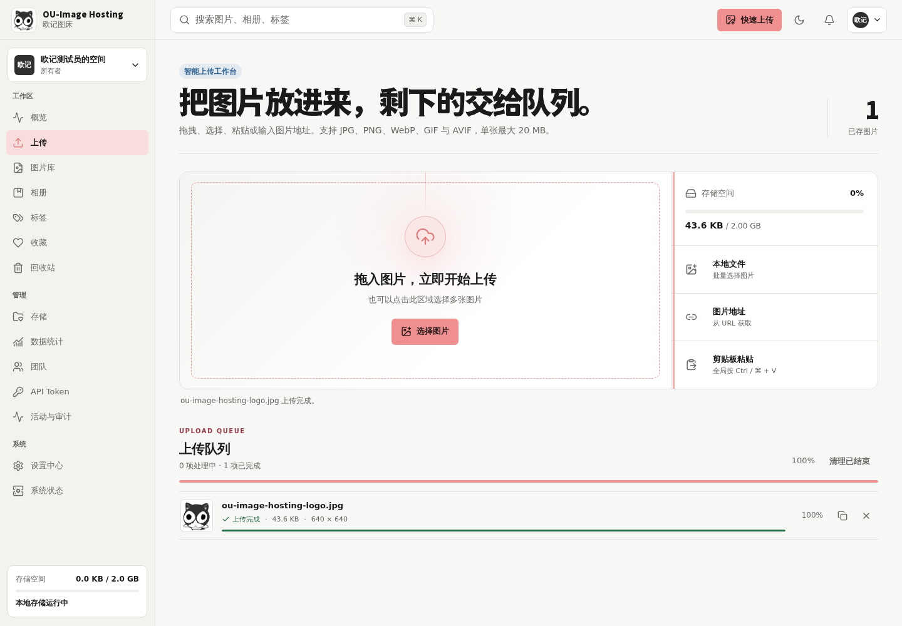

<p align="center">
  
</p>

<h1 align="center">OU-Image Hosting</h1>

<p align="center">
  <strong>欧记图床</strong> · 好看的图片，也值得被好好管理。
</p>

<p align="center">
  一个重视视觉、效率与安全边界的现代自托管图床。
</p>

<p align="center">
  <a href="https://github.com/cshaizhihao/ou-image-hosting/releases">
    
  </a>
  
  <a href="https://github.com/cshaizhihao/ou-image-hosting/actions/workflows/check.yml">
    
  </a>
  <a href="https://github.com/cshaizhihao/ou-image-hosting/actions/workflows/docker.yml">
    
  </a>
  
  
</p>

<p align="center">
  <a href="#一键安装">一键安装</a>
  ·
  <a href="#功能一览">功能一览</a>
  ·
  <a href="./docs/deployment.md">部署文档</a>
  ·
  <a href="./docs/backup-restore.md">备份恢复</a>
</p>

<br />

<p align="center">
  
</p>

## 这是什么

OU-Image Hosting 不只是一个生成图片外链的上传框。

它把上传、整理、编辑、版本、分享、团队权限、数据统计、备份恢复与系统状态放进同一个清晰、克制、好看的工作台，适合个人创作者、开发者与小型团队部署在自己的服务器上。

## 为什么选择它

<table>
  <tr>
    <td width="50%">
      <strong>✦ 视觉不是装饰</strong><br />
      浅色、深色、桌面与移动端使用同一套设计语言。后台 100% 浏览器缩放下保持更舒服的字号、间距和操作反馈。
    </td>
    <td width="50%">
      <strong>⇧ 上传是一条完整工作流</strong><br />
      支持拖拽、批量选择、剪贴板、URL、队列、暂停、重试、去重、缩略图与上传完成后一键复制链接。公共页可选择访客直传或登录后上传，登录用户还能回看自己的上传历史。
    </td>
  </tr>
  <tr>
    <td width="50%">
      <strong>⌘ 图片真正可管理</strong><br />
      网格与列表、搜索、格式筛选、状态标签、相册卡片、标签、收藏、回收站、批量公开/隐藏/收藏/加入相册和滚动位置恢复都围绕高频整理场景设计。
    </td>
    <td width="50%">
      <strong>↗ 分享保持可控</strong><br />
      提供 URL、Markdown、HTML、BBCode、二维码、访问统计、密码、有效期、公开图库预览浮窗，以及批量公开/隐藏和相册归档管理。
    </td>
  </tr>
  <tr>
    <td width="50%">
      <strong>◎ 团队与安全边界明确</strong><br />
      多工作区、Owner/Admin/Editor/Viewer、API Token Scope、IP 白名单、TOTP、会话管理、通知和审计日志。
    </td>
    <td width="50%">
      <strong>◉ 部署后仍然好维护</strong><br />
      Docker Compose 三服务、健康检查、系统状态、原子备份恢复、资源限制、优雅关闭和完整运维文档。
    </td>
  </tr>
</table>

## 一键安装

### 环境要求

- Linux 服务器，具有 root 或 sudo 权限
- 使用 apt、dnf、yum、pacman、zypper 或 apk 之一
- 能用 curl 下载一键安装脚本
- 公网 HTTPS 部署需要域名解析到服务器，并放行 TCP 80/443

Git、OpenSSL、coreutils、CA 证书、Docker Engine 与 Docker Compose v2
无需预先安装。安装器会检测缺失项，显示将执行的操作并自动补齐：
apt/dnf/yum 系统使用 Docker 官方安装程序，pacman/zypper/apk 系统使用
发行版原生 Docker 软件包。macOS 仍需安装并启动 Docker Desktop。

### 交互式安装

复制下面这一行到终端：

```bash
curl -fsSL https://raw.githubusercontent.com/cshaizhihao/ou-image-hosting/main/install.sh | bash
```

安装器使用品牌色和猫咪艺术字，并通过交互问答完成配置：

```text
       /\_/\
      ( o.o )      ██████╗ ██╗   ██╗
       > ^ <      ██╔═══██╗██║   ██║
                  ██║   ██║██║   ██║
                  ╚██████╔╝╚██████╔╝
                   ╚═════╝  ╚═════╝
              IMAGE HOSTING · 欧记图床
```

它会依次完成：

1. 识别操作系统和包管理器，自动补齐 Git、curl、OpenSSL、coreutils。
2. 缺少 Docker Engine 或 Compose v2 时，按发行版选择官方脚本或原生软件包安装并启动服务。
3. 询问安装目录、访问地址、HTTPS 接入方式、监听端口和存储配额。
4. 克隆项目；重复执行时安全更新已有安装。
5. 生成权限为 `600` 的生产配置和 256-bit 随机密钥。
6. 升级时保留原加密密钥，并备份现有 `.env.production`。
7. HTTPS 域名默认部署 Caddy，自动申请并续期证书。
8. 顺序构建 API 与 Web，避免两个镜像同时构建。
9. 安装全局 `ouih` 管理命令。
10. 启动容器，依次验证 readiness、TLS 证书、HTTPS 反向代理与公网跳转地址，拒绝泄露内部 `:3000` 端口。

安装完成后，打开安装器显示的地址，跟随页面向导创建站点和第一个管理员。

### Cloudflare 域名

1. 在 Cloudflare DNS 中添加指向服务器公网 IP 的 `A` 记录；存在 IPv6 时再添加 `AAAA`。
2. 开启该记录的小黄云代理，并把 Cloudflare SSL/TLS 模式设为 `Full (strict)`。
3. 在云厂商安全组和服务器防火墙中放行 TCP `80`、`443`。
4. 首次签发证书期间关闭 Cloudflare `Always Use HTTPS` 和自定义强制 HTTPS 重定向规则，安装成功后可以重新开启。
5. 运行一键安装，选择「公网 HTTPS 域名」和「Cloudflare 小黄云」。
6. 安装器会先验证 Caddy 公共源站证书，再验证 Cloudflare 边缘响应；不要使用 `Flexible`。

如果服务器已有 Nginx、Caddy、宝塔或 1Panel 反向代理，安装时选择「使用现有反向代理」，或传入 `--proxy external`，然后把域名转发到安装器显示的 `127.0.0.1:<端口>`。

### 无人值守安装

使用默认配置安装到 `~/ou-image-hosting`：

```bash
curl -fsSL https://raw.githubusercontent.com/cshaizhihao/ou-image-hosting/main/install.sh \
  | bash -s -- --yes
```

指定公网域名、端口和空间配额：

```bash
curl -fsSL https://raw.githubusercontent.com/cshaizhihao/ou-image-hosting/main/install.sh \
  | bash -s -- \
      --yes \
      --origin https://img.example.com \
      --proxy cloudflare \
      --port 3080 \
      --quota-gb 20
```

查看全部参数：

```bash
curl -fsSL https://raw.githubusercontent.com/cshaizhihao/ou-image-hosting/main/install.sh \
  | bash -s -- --help
```

如果服务器由你自行维护、不希望安装器修改系统软件：

```bash
curl -fsSL https://raw.githubusercontent.com/cshaizhihao/ou-image-hosting/main/install.sh \
  | bash -s -- --no-install-deps
```

<details>
<summary><strong>手动使用 Docker Compose 安装</strong></summary>

```bash
git clone https://github.com/cshaizhihao/ou-image-hosting.git
cd ou-image-hosting

cp .env.production.example .env.production
openssl rand -hex 32
```

将随机值写入 `.env.production` 的 `OU_SECRET_KEY`，配置实际 `APP_ORIGIN`、`OU_PUBLIC_HOST` 和 `OU_PROXY_MODE=caddy`，然后：

```bash
COMPOSE_PARALLEL_LIMIT=1 docker compose --env-file .env.production build api
COMPOSE_PARALLEL_LIMIT=1 docker compose --env-file .env.production build web
docker compose --env-file .env.production --profile https up -d
curl --fail http://127.0.0.1:3000/api/health/ready
```

</details>

## 功能一览

### 图片工作流

- 公共上传首页、访客批量上传、剪贴板粘贴、公开展示勾选、最近上传结果和缩略图公共图库
- 访客直传 / 登录后上传开关、登录用户上传历史、批量公开或隐藏自己的图片
- 公共图库站内浮窗预览，支持键盘左右键、鼠标滚轮、按钮和移动端滑动切换
- 本地选择、拖拽、剪贴板粘贴、URL 与批量上传
- 队列进度、暂停、继续、取消、失败重试与内容去重
- JPEG、PNG、WebP、GIF、AVIF 内容识别和尺寸限制
- EXIF 自动旋转、缩略图、格式转换、旋转与翻转
- 图片版本历史、恢复、重命名和原图访问

### 组织与分享

- 响应式网格/列表、搜索、格式筛选、排序、分页和图片状态标签
- 图片库多选工具栏支持批量公开、隐藏、收藏、取消收藏、加入相册和移入回收站
- 相册主分类卡片、搜索、编辑、删除确认、新建相册浮窗、图片库批量加入一个或多个相册
- 相册详情批量移出图片、封面选中态和失效封面自动清理
- URL、Markdown、HTML、BBCode 与二维码
- 密码保护、有效期、访问统计、分享撤销和创建成功浮窗

### 团队与管理

- 多工作区与四级角色权限
- 真实工作区概况面板：图片数量、容量比例、存储状态和快捷入口
- 可自定义站点名称、描述、Logo、公共首页文案和登录页文案
- 可控制公共上传、公共图库和访客上传时的默认公开状态
- 页面切换时保持完整权限导航，不再闪退管理与系统菜单
- 精确 Scope 的 API Token、有效期与 IP/CIDR 白名单
- TOTP 双因素认证、恢复代码和活跃会话管理
- 通知偏好、免打扰、审计筛选与 CSV 导出
- 数据统计、系统状态、设置中心和后台任务

### 存储与运维

- 本地原图、缩略图、版本和物理空间统计
- 更完整的概况面板：容量水位环、健康状态、平均图片大小、快捷入口和存储提醒
- S3、Cloudflare R2、S3-compatible 配置、迁移与内置分步教程
- 自定义域名、链接模板、防盗链和签名 URL
- gzip 完整备份、严格校验、维护模式与原子恢复
- `/health/live`、`/health/ready` 与 Docker 健康检查

后台针对浏览器 100% 缩放重新调整了侧栏、顶栏、字号和内容宽度；常用操作保持清晰、紧凑，桌面宽屏不再出现大面积无效留白。

## 日常运维

安装完成后直接运行 `ouih` 打开交互菜单：

```bash
ouih
```

交互菜单执行查看、启停、更新等操作后会停留在结果页面；按任意键返回上级菜单，不会立即清屏或退出。

也可以直接使用子命令：

```bash
# 查看访问地址与安装目录
ouih url
ouih dir

# 更新、状态与日志
ouih update
ouih status
ouih logs

# 停止 / 启动
ouih stop
ouih start
```

`ouih update` 会自动补齐 Git、curl、OpenSSL、coreutils 等基础依赖，并拒绝覆盖存在未提交修改的仓库；正常安装目录会先备份 `.env.production`，再同步远端 `main`，恢复生产配置与 `OU_SECRET_KEY`，顺序重建镜像并重新验证服务。

`ouih uninstall` 默认只移除运行中的容器并保留生产配置与 Docker 数据卷，方便重新安装恢复。永久删除图片与元数据必须显式使用数据清理选项并完成二次确认。

> 不要执行 `docker compose down -v`，除非你明确要永久删除全部元数据、图片、版本、缩略图和卷内备份。

## 部署边界

- 当前元数据由单个 API 进程通过原子 JSON 文件管理，请只运行一个 API 副本。
- 当前图片读写的权威来源是 Docker 持久化卷中的本地存储。
- S3/R2 已支持安全配置、连接探测和迁移，但日常读写尚未切换到远端。
- PostgreSQL、Redis 与 CDN 变量用于状态探测，不代表业务已经启用这些组件。
- 正式公网安装默认由内置 Caddy 提供 HTTPS；使用外部反向代理时必须正确转发原始 Host 与 HTTPS scheme。
- 备份应定期导出到服务器之外，Docker 数据卷不能替代异地备份。

## 技术栈

| 层级 | 技术 |
|---|---|
| Web | Next.js 15、React 19、TypeScript、Tailwind CSS 4 |
| UI | Radix UI、Lucide、三层 Design Token、浅色/深色主题 |
| API | Fastify 5、Multipart、Cookie、Rate Limit、Node.js Crypto |
| Image | Sharp、版本原图、WebP 缩略图、SHA-256 去重 |
| Runtime | Docker Compose、Caddy 自动 HTTPS、非 root、只读根文件系统、健康检查 |
| Test | Vitest、Playwright、Axe |

## 文档

- [生产部署](./docs/deployment.md)
- [备份与恢复](./docs/backup-restore.md)
- [版本升级](./docs/upgrading.md)
- [故障排查](./docs/troubleshooting.md)
- [威胁模型](./docs/threat-model.md)
- [性能预算](./docs/performance.md)
- [品牌规范](./docs/brand-guidelines.md)

## 品牌

- Logo 使用用户提供的黑白猫原图，只按比例缩放，不重绘、不改色。
- 品牌色为炭黑、暖白与鼻尖粉。
- 标题使用 Swei Ax Sans CJK SC Black 授权网页子集，正文使用系统字体保证阅读体验。

## License

项目代码使用 [MIT License](./LICENSE)。

品牌展示字体子集使用 [SIL Open Font License 1.1](./apps/web/public/fonts/SIL-OFL-1.1.txt)。
