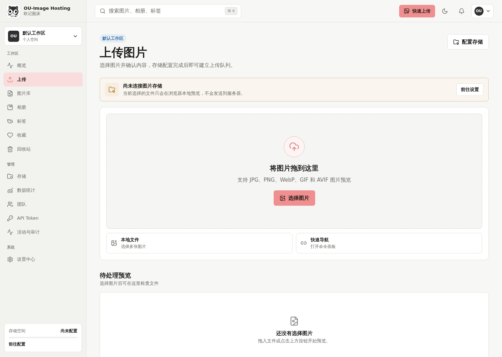
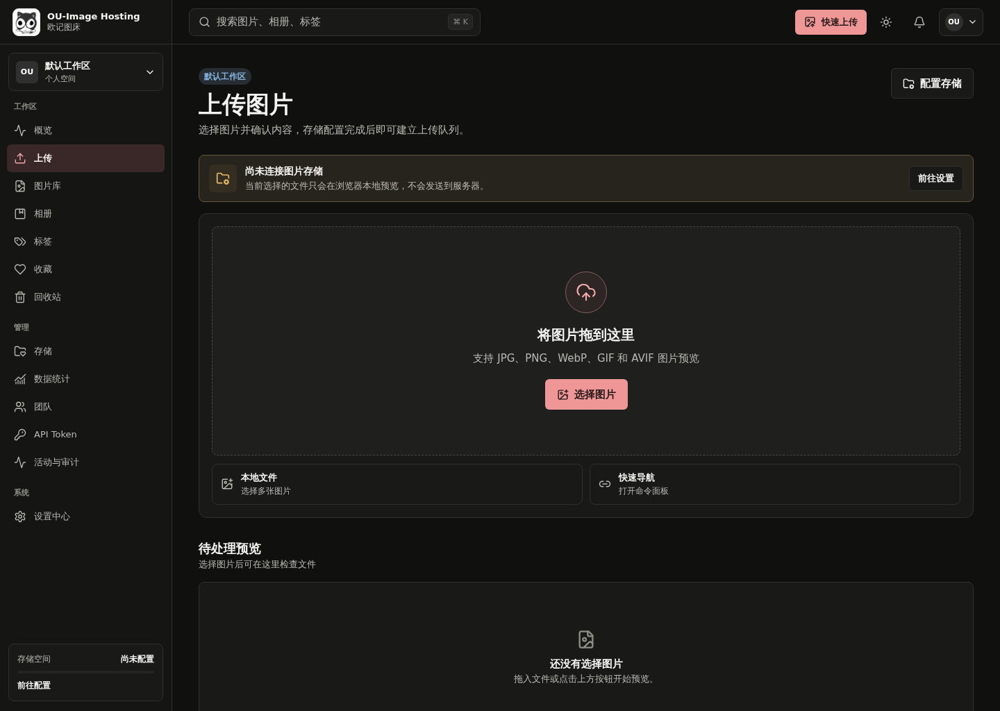
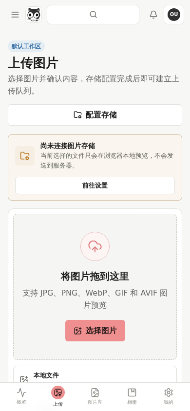
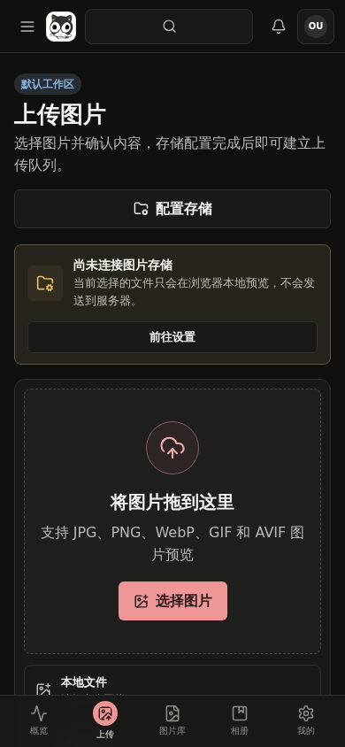

<p align="center">
  
</p>

<h1 align="center">OU-Image Hosting</h1>

<p align="center">
  欧记图床：一个从零构建、以视觉体验为核心的现代自托管图床与图片资产管理平台。
</p>

<p align="center">
  
  
  
</p>

## 项目介绍

OU-Image Hosting 不只是一个上传图片并返回链接的工具，而是一套面向个人创作者、开发者和小型团队的图片工作台。

项目坚持三个原则：

1. **好看是产品能力**：视觉、排版、动效和反馈不是最后补上的装饰。
2. **上传必须高效**：拖拽、粘贴、批量队列、失败重试和一键复制需要形成完整工作流。
3. **图片必须好管理**：搜索、标签、相册、批量操作、存储策略和审计记录必须清晰可靠。

## 当前版本

当前版本：**v0.2.0**

当前阶段已完成：

- pnpm Monorepo 与可复现依赖锁定
- Next.js Web 应用与 Fastify API 基础服务
- 三层 Design Token、浅色与深色主题
- 桌面侧栏、平板折叠栏和移动端底部导航
- 全局搜索命令面板、通知抽屉和用户菜单
- 图片拖拽、选择和浏览器本地预览
- 图片库、相册、标签、存储等模块路由骨架
- 404、403、500、加载和空状态页面
- Vitest、Playwright 与低 CPU 构建工具

## 计划功能

- 文件选择、拖拽、剪贴板和 URL 上传
- 多文件上传队列、实时进度、暂停、取消与失败重试
- 图片缩略图、格式转换、压缩、水印和元数据读取
- 图片库、相册、标签、收藏、搜索和批量操作
- URL、Markdown、HTML、BBCode 一键复制
- 本地磁盘、S3、Cloudflare R2 和其他 S3 兼容存储
- 自定义域名、签名链接、访问控制与防盗链
- 用户、团队、角色、审计日志和 API Token
- 流量、存储、上传趋势和热门图片统计
- Docker Compose 一键部署与完整安装文档

## 视觉方向

- Logo：用户提供的黑白猫形象
- 品牌色：炭黑、暖白、鼻尖粉
- 风格：轻量编辑器感、内容优先、清晰克制、带少量俏皮细节
- 圆角：以 8px 为主，不使用过度胶囊化和卡片套卡片
- 动效：160–320ms，强调操作结果与空间关系
- 图标：统一使用 Lucide 线性图标
- 主题：浅色优先，同时完整支持深色模式

详细规则见 [品牌规范](./docs/brand-guidelines.md)。

## 应用截图

### 桌面端

<p align="center">
  
  
</p>

### 移动端

<p align="center">
  
  
</p>

## 使用方式

当前版本可运行 Web 工作台和 API 健康检查：

1. 打开上传工作台，选择或拖入图片进行本地预览。
2. 使用侧栏或移动端底栏浏览各功能模块。
3. 使用 `Ctrl/Cmd + K` 打开命令面板。
4. 使用顶栏主题按钮切换浅色和深色模式。
5. API 健康检查地址为 `http://localhost:4000/health`。

## 安装方式

```bash
git clone https://github.com/cshaizhihao/ou-image-hosting.git
cd ou-image-hosting
corepack enable
corepack prepare pnpm@9.15.9 --activate
pnpm install
cp .env.example .env
```

启动 Web：

```bash
pnpm dev
```

另一个终端启动 API：

```bash
pnpm dev:api
```

生产构建：

```bash
pnpm check
```

在 CPU 受限的主机上，可使用项目提供的限速脚本：

```bash
scripts/run-low-cpu.sh pnpm build
```

## 技术架构

已实现：

- Web：Next.js、React、TypeScript、Tailwind CSS
- UI：Radix primitives、Lucide Icons、自有设计令牌与组件库
- API：Fastify、TypeScript、健康检查
- Testing：Vitest、Playwright

后续轮次集成：

- API 文档：OpenAPI
- Database：PostgreSQL、Drizzle ORM
- Queue：Redis、BullMQ
- Image：Sharp
- Storage：Local、S3、Cloudflare R2、S3-compatible
- Deployment：Docker Compose

## 开发与同步规则

仅将与项目实现、正式设计资产、测试、部署和版本发布直接相关的内容提交到仓库。会话草稿、私人参考资料、AI 提示词和临时分析文件不得入库。

每轮产生代码相关更新时，必须同时完成：

1. 完成该轮代码和测试。
2. 更新 `VERSION`。
3. 更新 `CHANGELOG.md`。
4. 更新 README 的版本、功能、使用方式、安装方式和截图。
5. 检查项目中不存在其他项目的名称、代码痕迹或品牌资产。
6. 提交 Git Commit 并推送到 GitHub `main`。
7. 在轮次总结中提供版本号、Commit Hash、测试结果和截图路径。

## 路线图

完整计划见 [ROADMAP.md](./docs/ROADMAP.md)。

| 轮次 | 版本 | 目标 |
|---|---:|---|
| 1 | v0.2.0 | 设计系统、应用壳层和工程基础（已完成） |
| 2 | v0.3.0 | 安装、认证与首次使用引导 |
| 3 | v0.4.0 | 上传引擎、队列与图片处理 |
| 4 | v0.5.0 | 图片库、筛选和批量操作 |
| 5 | v0.6.0 | 图片详情、编辑、分享与版本 |
| 6 | v0.7.0 | 相册、标签、收藏和回收站 |
| 7 | v0.8.0 | 存储、域名、防盗链与备份 |
| 8 | v0.9.0 | 团队、权限、API 与安全 |
| 9 | v1.0.0-rc.1 | 数据统计、系统状态与设置中心 |
| 10 | v1.0.0 | 质量收口、部署文档与正式发布 |

## License

[MIT](./LICENSE)
